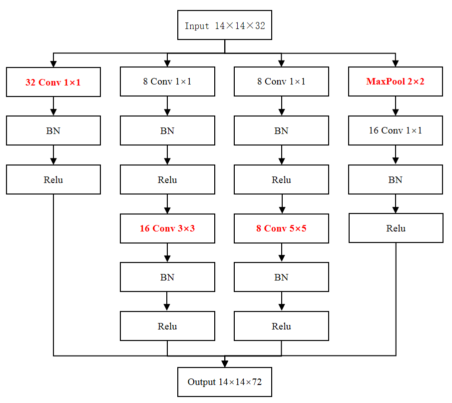
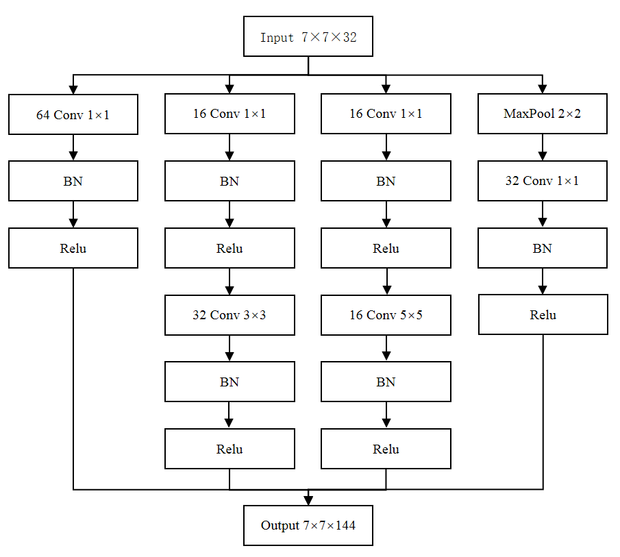
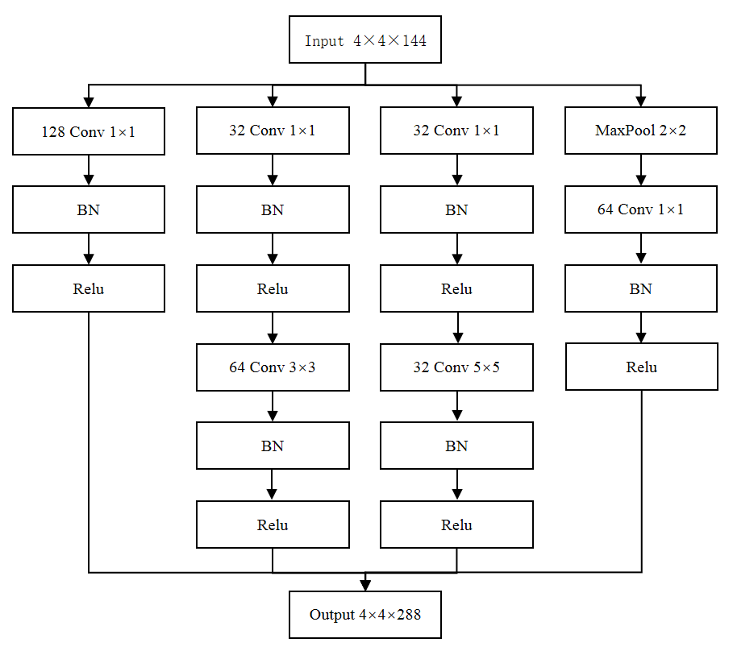
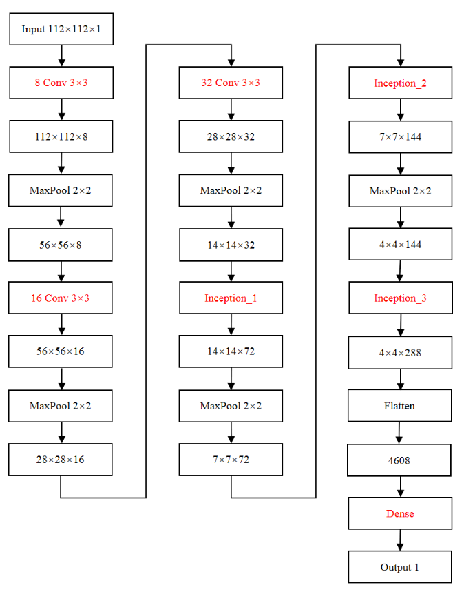

# fake_fingerprint_detection_algorithm
这个项目是本人的本科毕业设计——假指纹检测算法，仅供各位朋友学习与参考。  

## 中文摘要
指纹识别技术是当前十分流行并且飞速发展的身份认证技术，然而近些年假指纹攻击已经成为了使用指纹识别系统的严重问题。假指纹攻击指的是使用人工制造的假指纹进行指纹识别并达到与真指纹相同的效果来进行破解。因此针对这种假指纹攻击，假指纹检测技术应运而生。其中光学指纹，即使用光学指纹采集仪采集的指纹图像的防伪检测又是难点。

本文提出了一个基于卷积神经网络的指纹防伪算法，网络中的核心部分为三个Inception模块。本文所使用的训练数据来源于LivDet 2019，经过划分得训练集163840张，验证集16384张，测试集480张图像，其中真指纹与四种不同材料假指纹的图像比例为4：1：1：1：1。编程语言为Python，采用了Keras和TensorFlow深度学习框架，并且使用了Cuda框架和Cudnn库对训练进行了GPU加速。

经过30次完整迭代，76800次权值更新训练得到的网络权值在测试集上进行了测试，结果为：总准确率96.875%，拒真率1.666%，认假率4.583%，损失为0.2455。在训练集上的准确率为99.91%，损失为0.0031，在验证集上准确率为99.98%，损失为0.0011。网络最优权值出现在第19次迭代结束。表明本文所提出的算法具备良好的准确率，同时拒真率与认假率也同时保持在一个较小的水平。
**关键词**：假指纹检测，光学指纹，卷积神经网络，Inception

## 英文摘要  
Fingerprint recognition technology is a very popular and rapidly developing identity authentication technology. However, in recent years, fake fingerprint attacks have become a serious problem in the use of fingerprint recognition systems. Fake fingerprint attack refers to the use of artificially manufactured fake fingerprints for fingerprint recognition and the same effect as live fingerprints for cracking. Therefore, for this fake fingerprint attack, fake fingerprint detection technology came into being. Among them, the optical fingerprint that is the anti-counterfeiting detection of the fingerprint image collected by the optical fingerprint collecting instrument is difficult.

This thesis proposes a fingerprint anti-counterfeiting algorithm based on convolutional neural network. The core part of the network is three Inception modules. The training data used in this thesis is from LivDet 2019. The training set is 163840, the validation set is 16384, and the test set is 480 images. The ratio of live fingerprint to four different material fake fingerprints is 4:1:1:1:1. The programming language is Python, using the Keras and TensorFlow deep learning framework, and using the Cuda framework and the Cudnn library for GPU acceleration.

After 30 complete iterations, the network weights obtained from 76800 weights updating training were tested on the test set. The results showed that the total accuracy rate was 96.875%, the false rejection rate(frr) was 1.666%, the false acceptance rate(far) was 4.583%, and the loss was 0.2455. The accuracy rate on the training set is 99.91%, the loss is 0.0031, the accuracy on the verification set is 99.98%, and the loss is 0.0011. The network optimal weight appears at the end of the 19th iteration. The experimental results are compared with the results of the LivDet 2019 competition algorithm. The results show that the proposed algorithm has good accuracy, while the false rejection rate(frr) and the false acceptance rate(far) are kept at a small level.
**Keywords**：fake fingerprint detection, optical fingerprint, convolutional neural network, Inception

## 简介
本项目实现了一个基于卷积神经网络(CNN)以及Inception结构(来源于GoogLeNet)的假指纹检测算法。是一个非常小型的机器学习项目，实验跑在本人的笔记本上(15年购买)。由于训练数据为163840张112*112像素的灰度图，大概1.6gb左右比较庞大，并没有上传。训练数据来源于LivDet竞赛，如果希望复现本文所提算法，需要自己切割、旋转训练数据。 

### 实验环境
* 开发语言
    * Python
Python是一个高层次的结合了解释性、编译性、互动性和面向对象的脚本语言。Python在Web和Internet开发、科学计算和统计、软件开发、后端开发、机器学习等领域具有较好的应用。Python还具有很多优点，比如设计的时候Python就遵循简单主义，所以Python的使用非常简单，可以让使用者将自己的精力集中在解决问题的思路上，而不是代码语言本身。而Python的简单也意味着学习成本低，初学者可以很顺利的掌握Python编程基础，特别是有其他语言编程基础的人，也就是易上手。丰富的库，这一点也是吸引机器学习相关人员使用Python作为主语言的重要原因之一，除了强大的标准库，Python的各种第三方库也都具备相当高的质量。
    * Anaconda
Anaconda是一个Python的开源包、环境管理器，也可以看作是一个Python发行版本。使用Anaconda进行包管理，十分方便，并且配合PyCharm使用，可以可视化地管理Python包及其依赖，为Python开发带来极大的方便。并且使用Anaconda相当于创建了一个虚拟的环境与系统环境隔离开来，也可以自由切换。  
* 开发框架
    * TensorFlow
    TensorFlow说是目前最为流行的开源深度学习框架可以说是毫无问题。截至2019/5/14，在github上TensorFlow项目获得了8587个Watch，127501个Star，74601个Fork，1987个contributors。TensorFlow是一个开源的软件库，多维数据数组(tensor也叫张量)可以在其中的节点间灵活的流动(flow)，这也是其名字的来源。TensorFlow是谷歌开发的，目的是方便机器学习和深度神经网络的研究，经过时间的检验，该框架具有足够的通用性，可以应用到其他领域中。
    * Keras
    Keras是Python中的高层神经网络的API，以TensorFlow、Theano、CNTK作为后端，可以任意选用。使用Keras可以更快的上手深度学习，并且Keras对CPU和GPU都有良好的支持，之间的切换也十分简洁，并不繁琐。目前Keras对于Python的适配版本是2.7-3.6。

* 开发环境
    * 电脑环境
        1. 电脑：华硕K550JX4200
        2. 操作系统：Windows8.1 中文版
        3. CPU:Intel Core i5-4200H
        4. GPU:Nvidia GTX950M
        5. 内存：8GB
    * Python 环境
        1. Python IDE:PyCharm 2018.2.4x64
        2. Python:3.6
        3. Keras:2.2.4
        4. TensorFlow:1.13.1
    * GPU加速
        1. Cuda:10.0.130
        2. Cudnn:7.3.1
    * 训练可视化
        1. TensorBoard:1.13.1

### 训练集划分
1. 训练集
本文所提出的卷积神经网络采用了163840张前文提到的图像作为训练集，其中81920张为真指纹图像，20480张共聚酯假指纹图像，20480张明胶假指纹图像，20480张乳胶假指纹图像，20480张木浆胶假指纹图像，即他们的比例为4：1：1：1：1。
2. 验证集
本文采用的验证集使用了16384张图片，他们的分布与训练集保持一致，只是等比例缩小了10倍。即8192张为真指纹图像，2048张共聚酯假指纹图像，2048张明胶假指纹图像，2048张乳胶假指纹图像，2048张木浆胶假指纹图像。
3. 测试集
本文采用的测试集使用了480张图片，他们的分布与训练集、验证集保持一致。即240张为真指纹图像，60张共聚酯假指纹图像，60张明胶假指纹图像，60张乳胶假指纹图像，60张木浆胶假指纹图像。  

训练集、验证集、测试集的图片数据都是相互独立的，即不存在一张图片，同时属于两个或三个集合中。这也是为了保证测试数据的无偏性，毕竟在网络训练的调参中，网络会逐渐适应验证集的情况，在验证集上做出更好的表现，所以在验证集上的表现并不具有无偏性，最后需要用一个测试集来测试算法的性能。

### 网络结构
#### Inception_1结构示意图

#### Inception_2结构示意图

#### Inception_3结构示意图

#### 完整网络结构示意图

具体内容参考代码以及word文档。